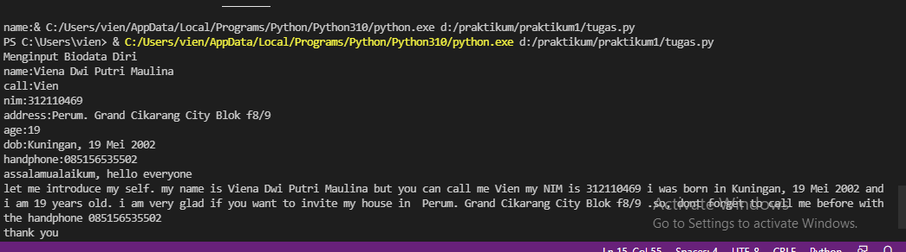
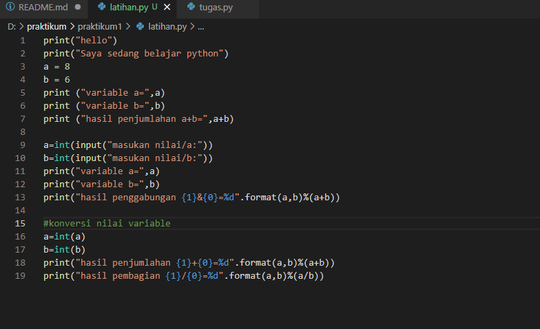
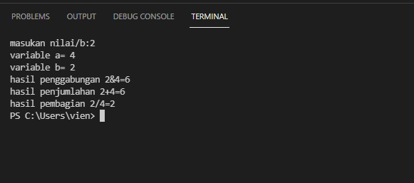

# praktikum1
## Nama : Viena Dwi Putri Maulina
### Nim : 312110469
#### Tugas Bahasa Pemrograman

##### Membuat Program Biodata

 ketik script seperti berikut

 kemudian run, input data 

 hasil output adalah hasil data yang kita inputkan 

 maka hasil nya seperti ini 

###### Membuat Program Penjumlahan dan Pembagian

 ketik script seperti berikut 

 kemudian run, input angka yang diinginkan. kemudian hasil nya seperti ini 

Terimakasih 

